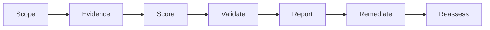

# Toolkit Overview

## What This Toolkit Does

The toolkit helps assessment teams evaluate how well cloud governance practices are working in the real operating environment.
It provides the structure for collecting evidence, scoring current maturity, reviewing risk, and turning the result into a roadmap that leaders can act on.
It is designed to keep the assessment reproducible and decision-ready.
It should make it easier to compare one environment to another without losing nuance.

## Assessment Flow

## What It Covers

- governance ownership and decision rights
- architecture and platform controls
- reliability and observability
- disaster recovery and continuity
- FinOps and cost accountability
- security and compliance practices
- executive reporting and remediation planning

## Who Uses It

- enterprise architects
- cloud governance leads
- SRE and operations leaders
- security and compliance teams
- finance and FinOps teams
- executive sponsors

## How To Read The Output

- scorecards show where the operating model is strong or weak
- checklists show whether the supporting controls actually exist
- questionnaires capture stakeholder responses and evidence pointers
- templates package the results for leadership and remediation teams

## Output Layers

| Layer | What It Captures | Best Artifact |
| --- | --- | --- |
| Evidence | Facts, screenshots, exports, and policy references | Checklists and questionnaires |
| Assessment | Maturity, confidence, and risk judgment | Scorecards and scoring model |
| Decision | Business impact and required action | Executive report and roadmap |

## What Good Looks Like

- each score can be traced to an artifact, interview, or system report
- each gap has an owner and an expected due date
- each executive report highlights the business impact, not just the technical issue
- each assessment can be repeated with the same method later for comparison
- each recommendation is written as an actionable change

## How To Read It

Start with the toolkit overview, then move into methodology and scoring.
That sequence keeps the discussion focused on what is being judged before getting into the mechanics of how it is judged.

## Result

The toolkit helps teams move from scattered observations to a repeatable assessment with a clear decision trail.

## Practical Use

Use this toolkit when you need a structured assessment that can support both operational improvement and executive decision-making.

## Success Criteria

- consistent scoring across domains
- clear separation of facts, interpretation, and recommendations
- assessment findings that support prioritization
- a roadmap that can be funded, tracked, and re-evaluated

## Practical Boundaries

- this toolkit should not be used as a one-size-fits-all control catalog
- it is meant to support assessment and decision support, not policy authorship
- detailed remediation work should be documented in the domain-specific repos
